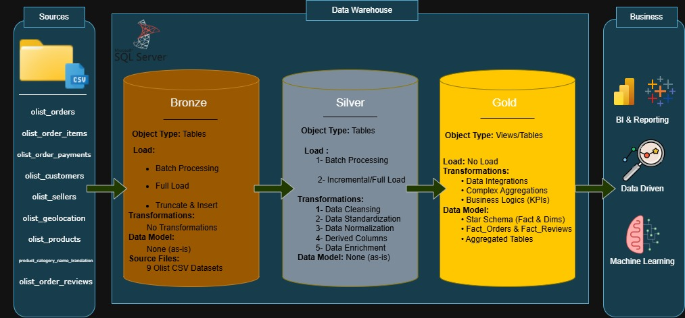

# 🛒 E-Commerce: End-to-End Data Warehouse & Analytics

## 📖 Project Overview
This project demonstrates a comprehensive data lifecycle for the **Olist E-commerce** dataset. It transitions from raw data engineering to advanced business intelligence and predictive modeling. The core of the project is built on **Microsoft SQL Server**, utilizing the **Medallion Architecture** to ensure data integrity and scalability.

---

## 🚀 Project Roadmap & Lifecycle
The project is executed in three strategic phases:

### **Phase 1: Data Warehousing (Medallion Architecture) 🏗️**
Focuses on building a robust infrastructure:
*   **Bronze Layer**: Initial ingestion of 9 raw CSV datasets with zero modifications to maintain a "Single Source of Truth"[cite: 1].
*   **Silver Layer**: Executing data cleansing, handling nulls in delivery dates, and translating Portuguese categories to English using **T-SQL**[cite: 1].
*   **Gold Layer**: Implementing a **Star Schema** (Fact & Dimension tables) optimized for high-performance analytical queries[cite: 1].

### **Phase 2: Exploratory Data Analysis (EDA) & BI 📊**
Extracting actionable business insights[cite: 1]:
*   **Diagnostic Analysis**: Identifying sales trends and top-performing product categories[cite: 1].
*   **Interactive Dashboards**: Developing comprehensive reporting in **Power BI**[cite: 1].

### **Phase 3: Advanced Analytics & Predictive Modeling 🧪**
Moving from historical analysis to future forecasting[cite: 1]:
*   **Demand Forecasting**: Evaluating time-series models to predict future sales[cite: 1].
*   **Customer Segmentation**: Applying **RFM Analysis** to identify high-value customer groups[cite: 1].

---

## 🖼️ Data Architecture Diagram
> **Note: Architecture Flow from Source to Gold Layer**
> 

---

## 📐 Dimensional Modeling (Star Schema)
The Gold Layer is modeled into a Star Schema to support efficient BI reporting[cite: 1].

### 📊 Schema ERD
> **Note: Visualizing Fact_orders and surrounding Dimensions**
>  
> *(Replace with your Schema export)*[cite: 1]

---

## 📝 Project Standards & Naming Conventions
To ensure professional consistency, the following standards are strictly followed[cite: 1]:

*   **Layer Prefixes**: `Bronze_`, `Silver_`, `Fact_`, `Dim_`[cite: 1].
*   **Attribute Naming**: Always use **camelCase** (e.g., `orderId`, `customerCity`)[cite: 1].
*   **Language**: 100% English technical documentation and naming[cite: 1].

| Layer | Example Table Name |
| :--- | :--- |
| **Bronze** | `Bronze_orderItems` |
| **Silver** | `Silver_orders` |
| **Gold (Fact)** | `Fact_orders` |
| **Gold (Dim)** | `Dim_products` |

---

## 🛠️ Tech Stack
*   **Database Engine**: Microsoft SQL Server (T-SQL)[cite: 1].
*   **Data Modeling**: Star Schema / Dimensional Modeling[cite: 1].
*   **Visualization**: Power BI[cite: 1].
*   **Planning**: Notion & Draw.io[cite: 1].

---
**Developed by Abdelrhman Ahmed**  
*Data Analyst Trainee [cite: 1]
